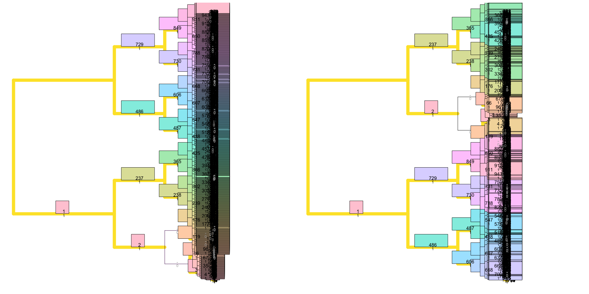

# AMbeRlandTR
Machine learning based lineage tree reconstruction. This package is associated with the following manuscript:

Alisa Prusokiene, Augustinas Prusokas, Renata Retkute. "Machine learning based lineage tree reconstruction improved with knowledge of higher level relationships between cells and genomic barcodes". https://doi.org/10.1093/nargab/lqad077

#### Installation

```r
library(devtools)
install.packages("phytools")
install.packages("phangorn")
install.packages("TreeDist")
install.packages("stringr")
install.packages("gbm")
install_github("rretkute/AMbeRlandTR")
``` 

#### Example use
This will produce trees with 1,024 cell tips. Approximate running time is 30-40 minutes on a MacBook Pro with 2.4GHz 8-Core processor.

```r
library(phytools)
library(phangorn)
library(TreeDist)
library(stringr)
library(gbm)
library(AMbeRlandTR)

set.seed(100)

## Set-up
targets<-2943  # Number of targets
notmut<- "0"  # Symbol for not-mutated state
mut<-"1"  # Symbol for mutated state
mut.rate<-0.0005446278 # Mutation rate (per division & target)
divisions<-10  #  Number of divisions

##  Create training data 
n.train<-10 # Number of colonies for training
training_data<-vector(mode = "list", length = n.train)
for(ii in 1:n.train){
  cat(c("Simulating tree no ", ii, "\n"))
  tree<-sim_tree(targets, divisions, mut.rate, notmut, mut)
  training_data[[ii]]<-tree
}

##  Fit ML models
ML.model<-fit.model(training_data)

## Tree reconstruction
thrs<-rep(0, 15)
# Simulate tree
treeGT<-sim_tree(targets, divisions, mut.rate, notmut, mut)
# Extract barcodes
xx <- data.frame(cell=str_split(treeGT$tip.label, "_", simplify=T)[,1],
                 state= str_split(treeGT$tip.label, "_", simplify=T)[,2])
# Reconstruct tree
lng<-make.lineage.thr.singl.mut(xx, ML.model, thrs)
treeRC<-read.newick(text=lng)
treeRC$edge.length<-NULL
# Change tip labels to cell id's instead of cell ids  and barcodes
treeGT$tip.label<-xx[,1]
rf<-RF.dist(treeGT, treeRC, normalize=TRUE)
cat(c( "RF", rf, "\n"))

# Depict the splits (top numbers) that are matched between two trees.
# Matched splits are assigned a similarity score of 1.
VisualizeMatching(RobinsonFouldsMatching, treeGT, treeRC)
``` 



